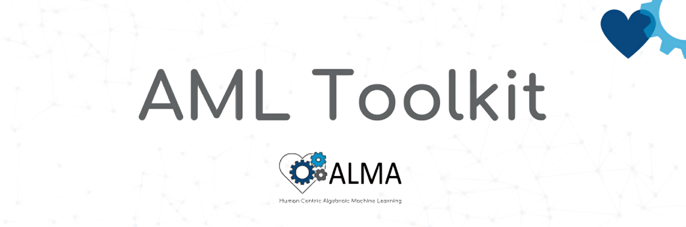

 

    <strong>
        <a href="https://aml-tools.readthedocs.io/en/latest/#get-access-to-aml-toolkit">Download</a>
        &nbsp;&nbsp;•&nbsp;&nbsp;
        <a href="https://aml-tools.readthedocs.io/en/latest">Docs</a>
        &nbsp;&nbsp;•&nbsp;&nbsp;
        <a href="https://alma-ai.eu/showroom/news">News</a>
        &nbsp;&nbsp;•&nbsp;&nbsp;
        <a href="https://x.com/AlgebraicAi">Twitter</a>
        &nbsp;&nbsp;•&nbsp;&nbsp;
        <a href="mailto:info@algebraic.ai">Contact Us</a>
    </strong>

  

*AML Toolkit* is a set of software tools that allows users to develop, train, and deploy Algebraic Machine Learning (AML) models.
These tools are designed to be used by researchers, developers, and industry professionals who want to implement AML models in their applications.
*AML Toolkit* aims to provide users, developers, and researchers with the documentation, guides, and examples needed to start working with AML.

These tools cover the entire process of developing AML applications, from data collection and preprocessing, to generating embeddings for problem description, validating those embeddings, training the model using an AML engine, perform inference using the resulted AML model, and validate the results.

This framework is developed as part of the [ALMA project](https://alma-ai.eu/).
The aim of the EU-funded ALMA project is to leverage AML properties to develop a new generation of interactive, human-centric machine learning systems.
These systems are expected to reduce bias and prevent discrimination, remember what they know when they are taught something new, facilitate trust and reliability and integrate complex ethical constraints into human-artificial intelligence systems.
Furthermore, they are expected to promote distributed and collaborative learning.

## Get access to AML Toolkit

The Open AML Engine can be obtained at [Algebraic-AI/Open-AML-Engine](https://github.com/Algebraic-AI/Open-AML-Engine).

To contact the engine team, you can open a discussion on the Github repository or send an email to [info@algebraic.ai](mailto:info@algebraic.ai).

Thank you for your interest in AML!

---

This project (ALMA: Human Centric Algebraic Machine Learning) has received funding from the European Union’s Horizon 2020 research and innovation programme under grant agreement No 952091.
